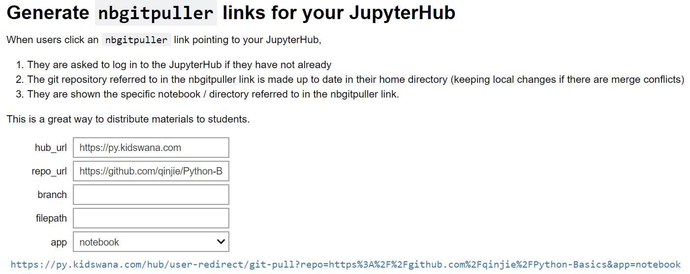

# Python Basics

nbgitpuller Link from GitHub to py.kidswana.com

* https://tinyurl.com/python-basic-course

Google Drive Folder

* https://tinyurl.com/python-basic-folder

1. Apply for an account at [https://py.kidswana.com](https://py.kidswana.com/)

2. Go to link to pull GitHub repo to your account.

   * https://py.kidswana.com/hub/user-redirect/git-pull?repo=https%3A%2F%2Fgithub.com%2Fqinjie%2FPython-Basics&app=notebook
   * https://tinyurl.com/python-basic-course

3. To generate above link. Use https://mybinder.org/v2/gh/jupyterhub/nbgitpuller/master?urlpath=apps/binder%2Flink_generator.ipynb

   